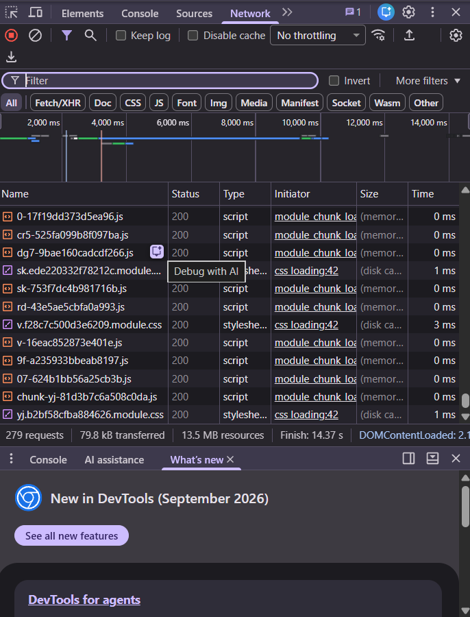

# Laporan Praktikum Pertemuan 1: Web Request Investigation

## 01. Identifikasi Aplikasi
* **Nama Aplikasi:** GitHub (Trending Developers Page)
* **URL Lengkap:** `https://github.com:443/trending/developers?spoken_language_code=en#top`
* **Anatomi URL (Breakdown Komponen):**
  * **Protocol/Scheme (`https://`):** Mengindikasikan komunikasi data dilakukan secara aman menggunakan enkripsi TLS/SSL.
  * **Domain/Hostname (`github.com`):** Alamat unik server target yang dituju di internet.
  * **Port (`:443`):** Port standar untuk lalu lintas HTTPS (bersifat opsional/implisit pada URL).
  * **Path (`/trending/developers`):** Jalur direktori atau lokasi spesifik dari resource yang diminta pada server.
  * **Query Parameter (`?spoken_language_code=en`):** Parameter tambahan dalam bentuk pasangan *key-value* (`spoken_language_code = en`) untuk memfilter konten berdasarkan bahasa.
  * **Fragment/Anchor (`#top`):** Penanda lokasi spesifik (elemen target) di dalam halaman web.

---

## 02. Screenshot Network Tab



---

## 03. 5 HTTP Request

| No | Method | Status Code | Content-Type | URL Endpoint |
|---|---|---|---|---|
| 1 | `GET` | `200 OK` | `text/html; charset=utf-8` | `https://github.com/trending/developers` |
| 2 | `GET` | `200 OK` | `text/css` | `https://github.githubassets.com/assets/light-88f123.css` |
| 3 | `GET` | `200 OK` | `application/javascript` | `https://github.githubassets.com/assets/app-19812a.js` |
| 4 | `GET` | `200 OK` | `image/png` | `https://github.githubassets.com/favicons/favicon.png` |
| 5 | `POST` | `204 No Content` | `text/plain` | `https://collector.github.com/github/collect` |

---

## 04. Analisis Arsitektur

* **Frontend:**
  * **Teknologi:** HTML5, CSS3 (Tailwind CSS / Primer CSS Framework), dan JavaScript (Web Components / ViewComponent).
  * **Fungsi:** Mengatur antarmuka pengguna (UI), *rendering* komponen halaman web, dan menangani interaksi pengguna di sisi *client*.
* **Backend:**
  * **Teknologi:** Ruby on Rails (Monolith / Microservices) dan Go (mungly / microservices untuk performa tinggi).
  * **Fungsi:** Memproses *business logic*, menangani autentikasi, memproses pemfilteran query parameter, dan berinteraksi dengan basis data.
* **Database & Cache:**
  * **Database Utama:** MySQL / PostgreSQL (Relational Database Management System) untuk menyimpan data pengguna, repositori, dan *metadata*.
  * **Caching & Search:** Redis / Memcached untuk *caching* sesi dan data *trending*, serta Elasticsearch / Git RPC service untuk pengelolaan pencarian cepat.

---

## 05. Diagram Arsitektur

Berikut adalah gambaran alur komunikasi dan arsitektur sistem sederhana dari aplikasi web tersebut:

```text
[ Browser / Client ]
        │
        ▼ (1) HTTP Request (GET/POST) via HTTPS (Port 443)
┌──────────────────────────────────────────────────┐
│             CDN / Load Balancer                  │
│  (Fastly / Cloudflare - Statics: CSS, JS, Images)│
└───────────────────────┬──────────────────────────┘
                        │
                        ▼ (2) Dynamic Request
┌──────────────────────────────────────────────────┐
│              Backend Application                 │
│         (Ruby on Rails / Go Services)            │
└───────────────┬───────────────────┬──────────────┘
                │                   │
  (3) Query Data│                   │(4) Read Cache
                ▼                   ▼
┌───────────────────────┐   ┌──────────────────────┐
│  Database Utama       │   │  In-Memory Cache     │
│  (MySQL / PostgreSQL) │   │  (Redis / Memcached) │
└───────────────────────┘   └──────────────────────┘
